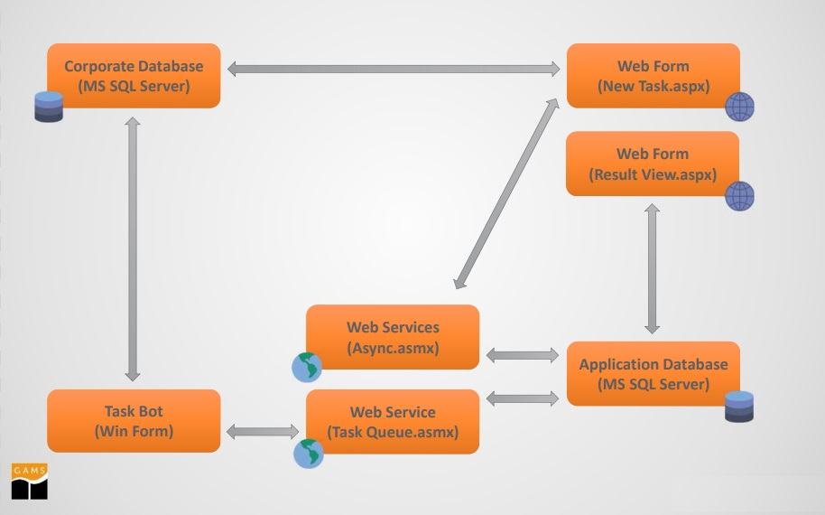

# MultiTierPOC
Web Based UI to issue and manage simple tasks, coded to operate with GAMS package.
Bots to operate on multiple machines, in synchronization with Web UI, used for performing actual mathematical calculations.

# How GAMS package works (roughly) #
GAMS package is a toolkit/software distribution which is deployed on a computer machine, let say a Windows Operated PC. The operator or user can now use the GAMS IDE or GAMS API to write code and execute algorithms. But do this, the user needs to be physically present on/around this PC.

# Why MultiTierPOC #
The idea of remotely performing predefined tasks/execution on a PC with GAMS licensed packages brings us to development of MultiTierPOC. 
Using MultiTierPOC we can utilize more than one machines using Bots to perform our tasks, the process can be monitored using Web UI.

# Bots #
A Bot is computer program that sits/installs on a PC with GAMS package, and is designed to perform a certain or multiple tasks. Bot receives tasks from the Task Queue (Web UI), performs the task/calculation with the help of GAMS package (PC) and submits results back to Task Queue (Web UI). The Bot may or may not directly communicate with another independent database server (DB) to acquire/submit data records pertaining to the Task its performing.
There can be multiple Bots on a single PC, or there can be single individual Bots on multiple PC's, flexibility according to design and computational power.

# Web UI #
Web UI is Asp.net based Control Center which sits on a dedicated Web Server (IIS) and is used to issue/generate, monitor, modify, view results of a task.
Task Queue is also maintained at same server. 

# Remote DB Server #
An optional DB that can be deployed/configured to facilitate consumption/storage of additional data records.

# Overview #

You may also have a look at the project presentation for further info. [Introductory Presentation](overview.pdf)

# Contribute #

Contributions to MultiTierPOC are highly appreciated! For further information please check our [CONTRIBUTE.md](CONTRIBUTE.md) and [Code of Conduct](CODE_OF_CONDUCT.md).

# How to build #
Important Software/Toolkit needed:
* Visual Studio 2015/2017
* DotNet Framework 4.0/4.5
* Entity Framework 6.1.3
* GAMS package >=23
* MSSQL DB Server >=2010

## 1. Download and install Visual Studio ##

MultiTierPOC relies on Microsoft Visual Studio 2015/2017 for handling of files and editing, it makes use of .net framework with C#, Asp.net & HTML CSS JS. The recommended way to get Visual Studio is via its official [VS online installer](https://www.visualstudio.com/downloads/). For starters and learning purpose Community edition of Visual Studio can be used for free. If looking for more intense and pro usage Professional edition should be looked into.

## 2. Download and install GAMS ##

MultiTierPOC requires the GAMS low-level APIs. All those files are provided by the GAMS distribution packages, which are available for all major platforms. The installation package for your platform can be obtained from the [GAMS download page](https://www.gams.com/download/). After downloading the package please follow the latest GAMS [installation instructions](https://www.gams.com/latest/docs/UG_MAIN.html#UG_INSTALL).

**Note** By default GAMS will run in demo mode. Please check the [download page](https://www.gams.com/download/). for further details.

## 3. Get the MultiTierPOC source code ##

Download the MultiTierPOC sources from GitHub (via git or as zip archive).

## 4. Building the MultiTierPOC project ##

* Install and Start Visual Studio.
* Open the project file 'MuliTierPOC.sln'.
* Add/Update reference to 'GAMS.net4.dll', available in GAMS installation folder.
* Click 'Build/Build Solution'. This generates the binary dll files '/bin folder'. 

## 5. Deployment and Usage ##

Deployment needs to be performed in two stages.
1) Web UI an ASP.net build should be deployed on a IIS server, along with database setup on MsSql Server. Sql script provided in db_TaskManager.sql
2) Bots should be deployed on individual Windows machines as executables.
3) There is a need to update access point of web UI deployment in Bot code files Service Reference. This is important as Bots need to communicate with TaskQueue for info Retrieval and Submission.
4) Any dedicate Database should also be deployed and configured. Eg. for Transport Bot, a Dedicated DB is setup and configured in OptimizationALgorithm.cs. Sql script provided in girish_Transport.sql